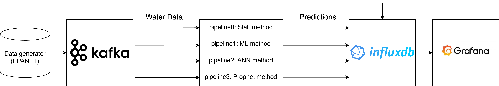

# A tool for Leak Detection in Water Distribution Networks

## Quick run
Start the application with the following command:
```shell
docker-compose up -d
```
Data should start flowing into the database, this process can be monitored using Grafana. Grafana can be accessed at:
```shell
http://localhost:3000
```
With the following credentials:
```shell
username: admin
password: bitnami
```

InfluxDB can also be accessed directly at:
```shell
http://localhost:8086
```
With the following credentials:
```shell
username: admin
password: bitnami123
```
# About 
The daily operation of water distribution networks involves many things such as ensuring quality and quantity of water. 
A significant problem for water distribution network operators is the forming of leaks due to for example wear and tear
of pipes. 

There is already a great body of research dedicated to the challenge of detecting these leaks automatically. 
The tool at hand provides a way to experiment with different methods of leak detection with synthesized data.

# Architecture Overview

The tool uses a number of `docker` containers which communicate with each other in different ways. A visual overview of
the technologies used is shown below.



## Data generator
The data generator uses [WNTR](https://wntr.readthedocs.io/en/latest/) to synthesize a dataset, this is then fed to 
Kafka to manage the distribution of the data.

## Kafka
Apache Kafka is an event streaming platform. In this project it serves to simulate the real-time streaming of data taken
from the synthesized dataset. Kafka sends the data to the numerous pipelines in the form of messages at a set
interval. 

## InfluxDB
InfluxDB serves as the data sink in this project. Predictions from the pipelines are saved there along with other things
such as the performance over time and the generated flow and pressure data from the data generator

## Grafana
Grafana is our main tool for visualizing the data. Provisioned dashboards are set up within Grafana enabling the user to
view the generated predictions in real-time. There is also a separate dashboard to view the performance of the 
algorithms over time.

# Config settings

## Global settings
#### Config parameters
`wdn_input_file_name` - Name of the file to use as the input network. Input network files should be kept in the 
`wdn_input_files` folder

`message_frequency` - This sets the delay for streaming the data using Kafka. If it is set to 0.5, pressure and flow 
data will be sent every 0.5 seconds.

`scenario_name` - Name of the scenario to use. This is also the name used for data synthesis so it should be set in line
with the `scenario_path` value in most cases.

`experiment_start_time` - This is the time from which Kafka should start streaming the data.

`scenario_path` - Path of the scenario that is used for all the experiments

## Data synthesis method

The data is synthesized using the [WNTR](https://wntr.readthedocs.io/en/latest/). [WNTR](https://wntr.readthedocs.io/en/latest/) 
is built upon [EPANET](https://www.epa.gov/water-research/epanet) which is the industry-standard for water distribution
network simulation.

#### Config parameters
`demand_input_file_path` - This is the path to the file that serves as the demand pattern for the synthesized scenario

`simulation_start_time` -  A date from which the simulation starts

`train_start` - The date from which the training set starts

`train_end` - The date that denotes the end of the training set

`val_start` - The date from which the validation set starts

`val_end` - The date that denotes the end of the validation set

`test_start` - The date from which the test set starts

`test_end` - The date that denotes the end of the test set

`leak_diameter` - Size of the leak, LeakDB takes this to be in the range [0.02-0.2)

`skip_nodes` - A list of node names describing which node data to leave out of the final file. This is helpful since 
reservoir nodes provide no useful data in terms of pressure and thus pollute the dataset.

`synthesize_data` - Whether to freshly synthesize data. If this is set to true, a new dataset will be generated upon
starting the tool.

`is_leak_scenario` - Whether the to be synthesized dataset should be a leak scenario or not.

`leak_node` - The node in which the leak should occur

## Leak detection methods
In total there are four implemented leak detection methods. Each one has its own `docker` container. Now follows a 
description of the different methods
### `pipeline0`
This pipeline uses a method based on a paper by [Puig et. al](https://doi.org/10.1016/j.conengprac.2011.06.004).
A leak scenario is simulated for each node to generate a pressure signature for a leak at that node. 
We then construct a *fault sensitivity matrix* based on the signatures from all the nodes. Finally, to determine if 
there is a leak, we compute the correlation between the current pressure signature, and the *fault sensitivity matrix*. 
If the correlation exceeds a certain threshold, the algorithm classifies the current time as a leak.

#### Config parameters
`train_model` -  Determines whether the algorithm should be trained again

`correlation_threshold` -  This is used as the threshold for the correlation

### `pipeline1`
A common approach seen in the literature for leak detection is the use of a machine learning classifier for the 
detection of leaks. This pipeline is dedicated to that type of approach. We have a basic `RandomForestClassifier` from the 
`sklearn` library implemented here. The idea is to train the classifier on time-series data from a leak detection 
scenario, treating each time point as a point for classification. The classifier is fed binary labels which simply 
reflect whether there is a leak or not.

#### Config parameters

`train_scenario_path` - This is used as the path for the training set. This should be set to a different scenario than 
the one we are experimenting with since we want the model to be tested on novel data.

### `pipeline2`
This pipeline used a method based on a paper by [Lee and Yoo](https://doi.org/10.3390/su13169262). The methods involves 
prediction of flow using one of the state-of-the-art methods for time-series prediction: a long short-term memory 
(LTSM) neural network. The flow is first predicted by the network, then based on the performance of the network on
the validation set, we generate a confidence interval for the prediction. If measured flow falls outside of the 
confidence interval of the prediction, we say there is a leak.

#### Config parameters
`train_model` -  Determines whether the algorithm should be trained again
`train_scenario_path` - This is used as the path for the training set. This should be set to a different scenario than 
the one we are experimenting with since we want the model to be tested on novel data.

`train_model` -  Determines whether the algorithm should be trained again

`z_value` - This is our z-value for calculating the confidence interval. A larger z-value means a larger confidence 
interval. 

`sequence_length` - This is our look-back for the time-series prediction. If it is 3, we look at the 3 previous values
to predict the current value

`sampling_rate` - This determines how often we sample to get our series for prediction. If it is 48, we sample every 
48 values. The data synthesizer generates half-hourly data so a `sampling_rate` of 48 means that we predict based on 
the previous n days.

### `pipeline3`
This pipeline uses Facebook's [Prophet](https://facebook.github.io/prophet/) model for flow prediction. We also use the
built-in confidence interval values from the model to generate the thresholds for leak detections.

#### Config parameters
`train_model` -  Determines whether the algorithm should be trained again